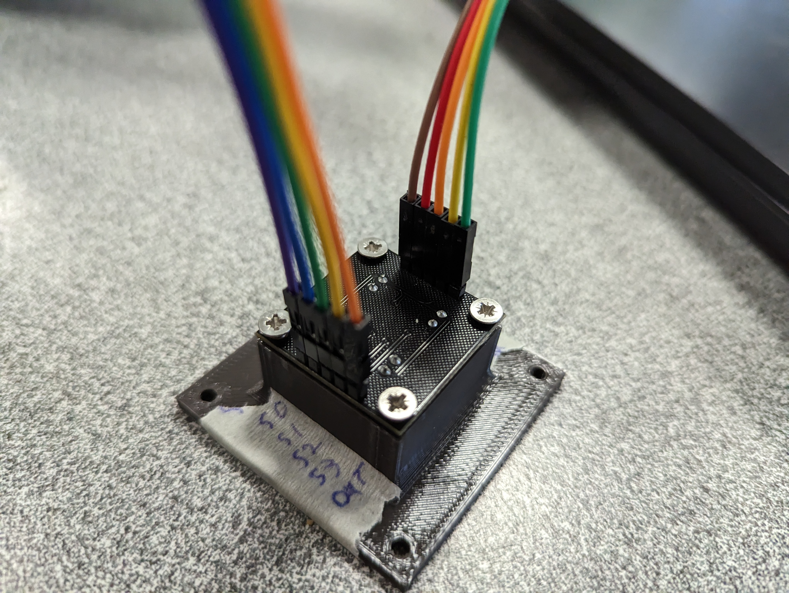
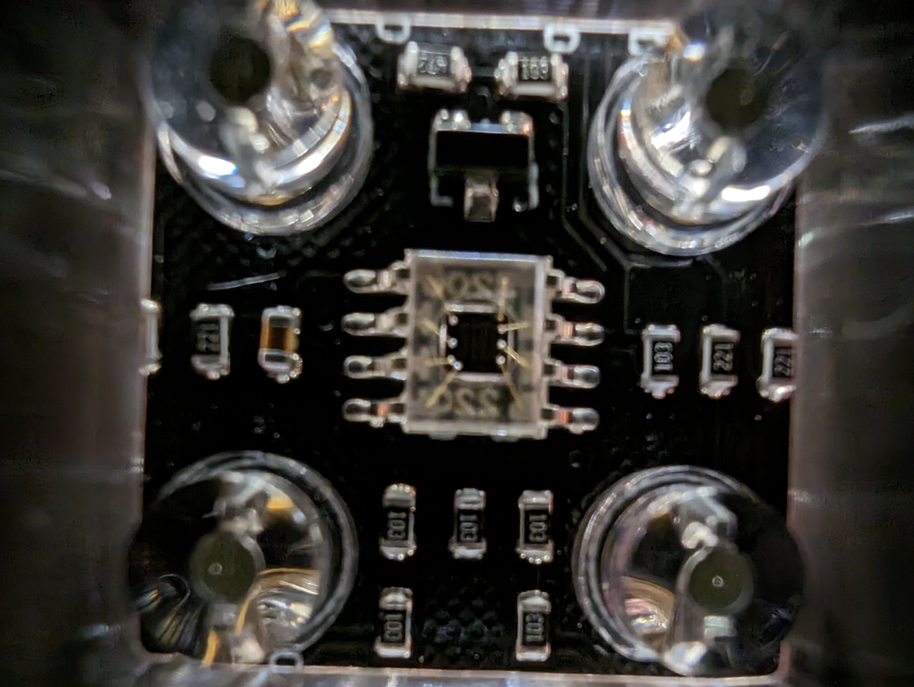
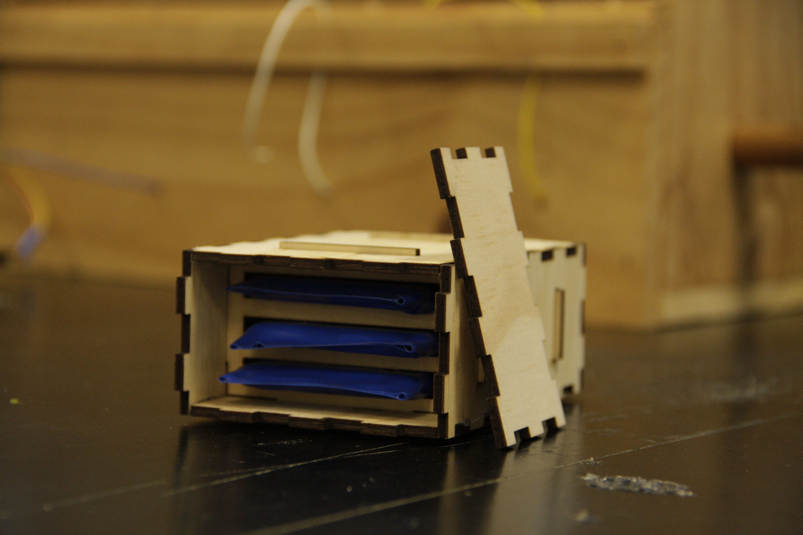
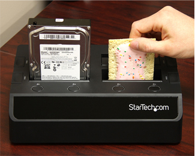
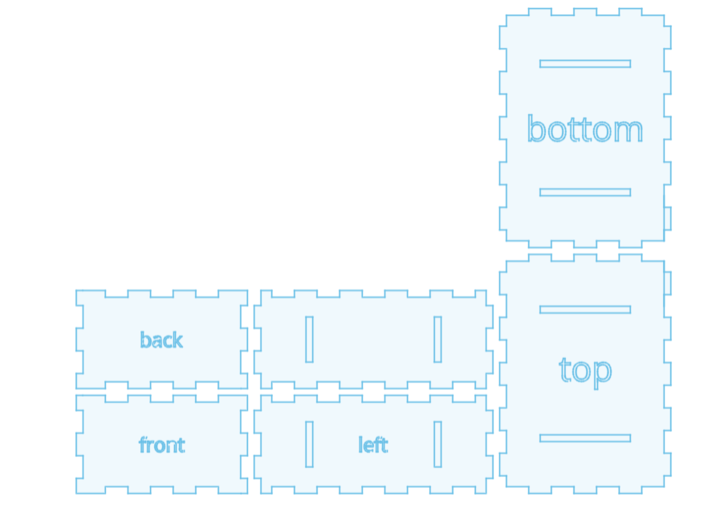
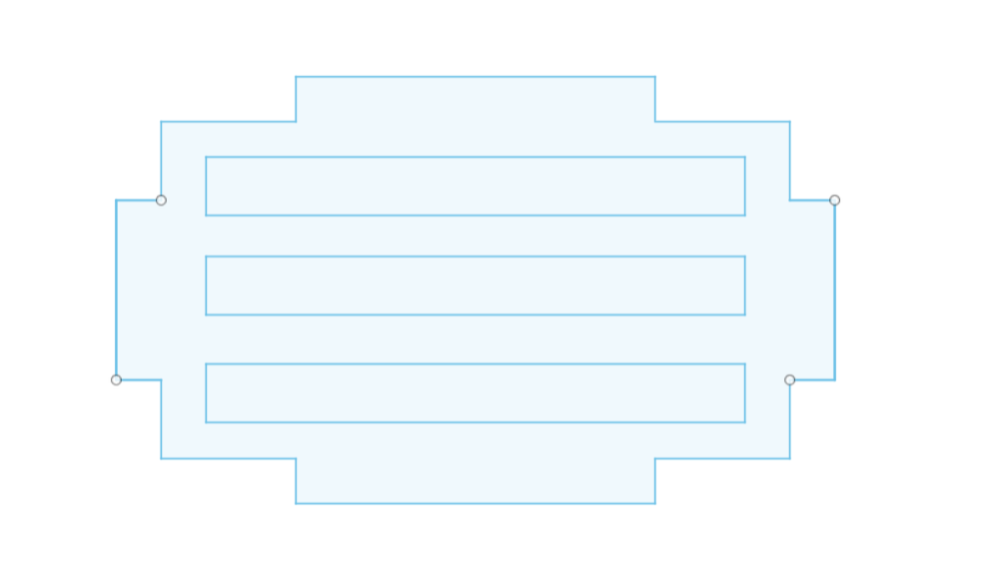

# Colour Sorter Year 12 Systems Project

## Overview
My original goal for this project was to create a connect 4 playing robot however this idea was scraped early due to it being too ambitious, insted i choise to create a colour sorting device that detects what colour it is and then sorts it accordingly

## Colour sensor

the sensor used is the TCS3200 it uses wavelength and rgb sensors to determen what colour its looking at, to help it tell what colour it is it uses 4 white leds to briten the object to alow it to be deteced easily.
 
 To mount the sensor i 3d printed a mount that places the sensor 17mm away from the object so the white leds dont touch it

#### Black Box Testing Envioment
.jpg)

.jpg)

 .jpg) 
The idea behind this was when i has calibrating the colour sensor i was running into inconcistent values, i discovered that the background affects the values and found out that black gave me the best results so before i build the full finnished device i make a fully black acrilic box with a removibale bottom to alow me to tune the sensor beforehand then make adjustments when needed 

## Power

to power my project i was innisualy going to use a 9v battery to run the whole thing but i came across these laptop batterys that where in good enoth condision to be repoupested. To house these batery cells or as i called them ***"Spicy Cells"*** i created a container i called the battery toster, a refrence to a joke in the pc comunity with hardrive docking bays looking like a toster

This is a StarTech Hard Drive bay

 [A Link to there website](https://www.startech.com/en-au)

To create the box i use a comenation of Fusion 360 and a website Called [MakerCase](https://en.makercase.com/#/) and that the base of it 
the cutout parts on some of those sides are to alow the middle beams to stay in place

## Code

i devleop the code i use arduino ide and used a veritey of code libraries like I2C, Servo and , on top of that i used a few example codes from other people [tcs3200](https://randomnerdtutorials.com/arduino-color-sensor-tcs230-tcs3200/ ) and [Ultrasonic sensor](https://arduinogetstarted.com/tutorials/arduino-ultrasonic-sensor-piezo-buzzer ) , With help from a friend i modified and intergrated the code to work togeather

although it was not compleate i managed to get  

[Code](posible_colour.ino)

## Issues
during the development of this project and doing the code i incounted some wierd bugs including the values reversing or giving compleatlt wrong values. Another thing that happened was that my laptop had all of its data wiped my by backup that i used called one drive, lucly with some help i got the data back.

## Reflection/Conclusions

in the future i would of used a python based controller and used a my time a bit more efectively to acheive my goal